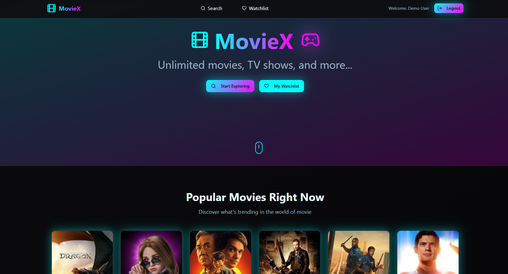
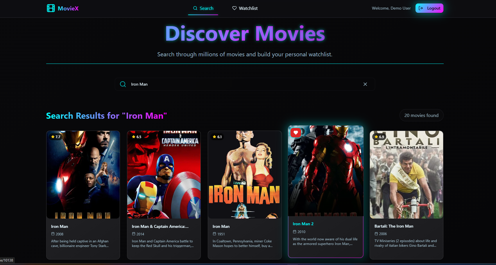

# Moviex 🎬

### Home Page
[](public/HomePage.png)
### Search Page
[](public/SearchPage.png)

Welcome to my **Moviex**, web application. Here i added all the features.

---

## ✨ Features

* **User Authentication**: Sign-in functionality handling with dummy data for frontend approach only and added cradentials on localStorage.
    * **Email**: `demo@moviex.com`
    * **Password**: `password123`
* **Watchlist Management**: Authenticated users can add and remove movies from their personalized watchlist.
* **Real-time Search**: Instantly find movies with a responsive search functionality.
* **Movie Details Pages**: Dedicated pages for each movie, providing with the information.
* **Intuitive Navigation**: Easily navigate between Home, Search, and Watchlist pages.
* **Responsive Design**: Built with Tailwind CSS and Shadcn UI for a sleek and adaptive interface across devices.

---

## 🚀 Technologies Used

* **Vite**: A fast build tool that provides an extremely quick development experience.
* **ReactJS**: A JavaScript library.
* **JavaScript**: Programming language for the application logic.
* **Shadcn UI**: A collection of reusable components.
* **Tailwind CSS**: A CSS framework.
* **TMDB API**: Used for fetching movie data.
* **Fake User Info**: Used for handling authentication.

---

## ⚙️ Getting Started

Follow these instructions to get a copy of the project up and running on your local machine.


### Installation

1.  **Clone the repository:**

    ```bash
    git clone [https://github.com/exact-coder/Moviex.git](https://github.com/exact-coder/Moviex.git)
    cd Moviex
    ```

2.  **Install dependencies:**

    Using npm:
    ```bash
    npm install
    ```
    Or using Yarn:
    ```bash
    yarn install
    ```


### Running the Development Server

To start the development server:

Using npm:
```bash
npm run dev
```
Or Useing npm:
```bash
yarn dev
```
This will open the application in your browser at `http://localhost:8080`.

### 🧑‍💻 Usage
Upon launching the application, you'll be on the Home Page.

Navigate to the `LogIn` page.

Use the following  credentials to log in:

Email: `demo@moviex.com`

Password: `password123`

Once logged in, you can use the Search functionality to find movies.

On a search result movies or movie's details page, you'll see options to Add to Watchlist or Remove from Watchlist if already added.

Visit the `Watchlist` page to view all your saved movies.

### 🎥 Project Walkthrough Video
For a visual demonstration of the Moviex application and its features, please refer to the following Google Drive link: [https://drive.google.com/drive/folders/1lBYtdwB-OtESkdCyMtvwqftpM0EpSMYu?usp=sharing](https://drive.google.com/drive/folders/1lBYtdwB-OtESkdCyMtvwqftpM0EpSMYu?usp=sharing)

